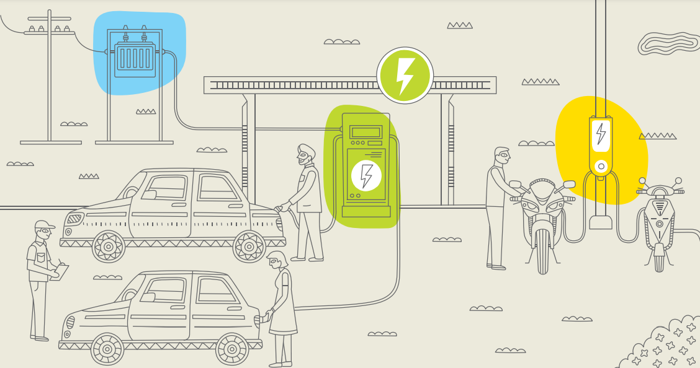
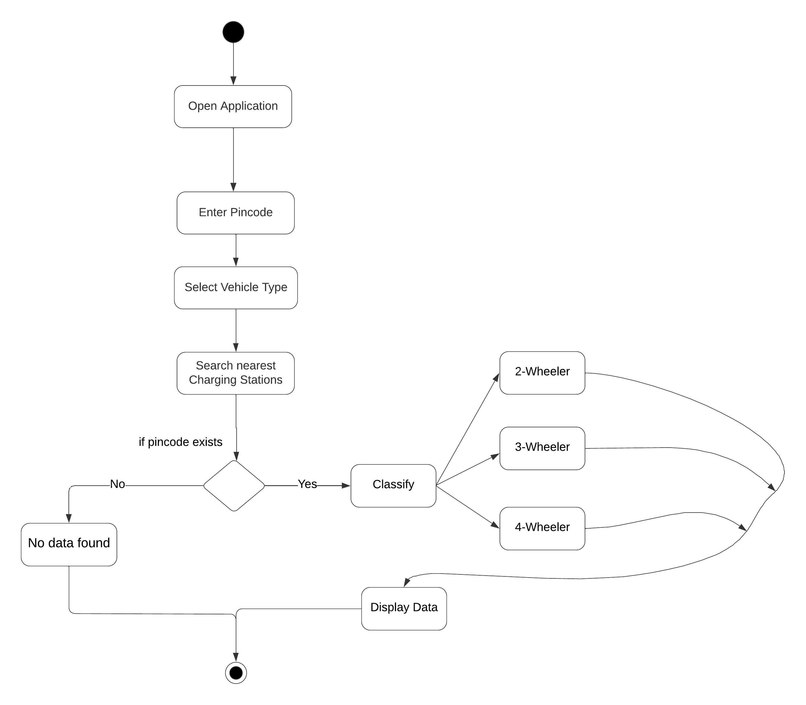

# ⚡ EV Spotter – Smart Web App for Locating EV Charging Stations  

> 🌱 A web application that helps **Electric Vehicle (EV) owners** quickly find nearby charging stations based on their location (via pincode). Built with **HTML, CSS, PHP, and XAMPP**.  

<p align="center">
  
</p> 

---

## 📌 Overview  

The increasing adoption of EVs demands **reliable and accessible charging infrastructure**.  
**EV Spotter** is a user-friendly web application that simplifies the process of locating charging stations by consolidating essential details in one place.  

✨ With EV Spotter, users can:  
- 🔍 Find **nearby charging stations** by entering a pincode  
- 🗂️ View station details (vehicle compatibility, charger types, timings, contact info, address)  
- 🌐 Access a smooth, responsive web app across devices  
- 📊 Work with a **real dataset** of 100+ EV stations in Hyderabad  

---

## 🛠️ Tech Stack  

- **Frontend**:    
- **Backend**:   
- **Database**:   
- **Server**: XAMPP (Apache + MySQL + PHP + Perl)
  
---

## 🔄 Workflow  

<p align="center">
  
</p>  

---
## 🎥 Demo Video  

[Watch the demo here](https://drive.google.com/file/d/1IAMQ5Mc45av0EIS2z-aIojW-U8qLziRS/view?usp=sharing)

---

## ⚙️ Setup Instructions  

## 1️⃣ Install Requirements  
- [Download XAMPP](https://www.apachefriends.org/download.html)  
- Make sure Apache & MySQL are running  

## 2️⃣ Setup Project  
1. Clone the repository:  
   ```bash
   git clone https://github.com/pallikondarakshan/EV-Spotter.git
   
2. Copy project folder into your XAMPP htdocs directory

    For example:
   ``` bash
   C:/xampp/htdocs/EV-Spotter/

## 3️⃣ Setup Database

Open phpMyAdmin (http://localhost/phpmyadmin)

Create a new database: spotter

Import dataset from /database/evspotter.csv (or .sql if you have it)

## 4️⃣ Run the App

Open browser and visit: http://localhost/EV-Spotter/index.php

---

## 🧪 Testing

✔️ Unit Testing: Verified pincode input & data retrieval

✔️ Integration Testing: Frontend ↔ Backend ↔ Database

✔️ Acceptance Testing: Real-world pincode searches across Hyderabad

---

## 🎯 Future Enhancements

📍 Google Maps API integration for precise geolocation

⭐ User ratings & reviews for charging stations

🔌 Station grouping (fast charging, standard charging)

📱 Progressive Web App (PWA) support for mobile

---

## ⭐ Why This Project Stands Out

🔥 Tackles a real-world sustainability challenge (EV adoption)

🏗️ Full-stack development: Frontend + Backend + Database

💡 Designed for scalability & future integration

🌍 Promotes green transportation & sustainable mobility

---

👨‍💻 Authors

Pallikonda Rakshan – [Linkedin](https://www.linkedin.com/in/rakshan-pallikonda/)
